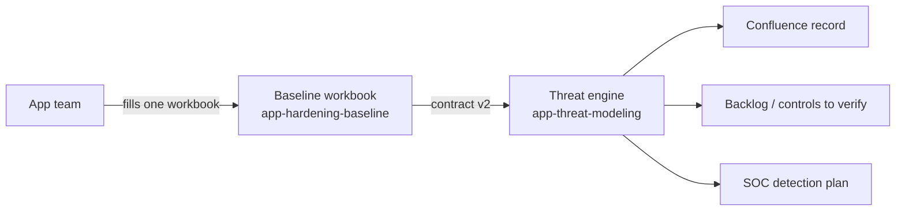

# Application Hardening Baseline

[](LICENSE)
[](https://github.com/OWASP/ASVS)
[](https://github.com/Zzanoni/app-hardening-baseline/actions/workflows/contract.yml)

## What this is, in plain terms

Every application (a website, a mobile app, an internal system) needs to be checked against a list of
security best practices — things like "passwords must be strong," "user sessions must expire," "sensitive
data must be protected." Doing this checklist from scratch for every application, in a Word document, is
slow and inconsistent: every app ends up with a different checklist, some things get forgotten, and nobody
can easily compare one application's security posture to another's.

This repository solves that with **one shared checklist**, built once and reused for every application in
the company. Instead of writing a new document each time, you answer a short questionnaire about the
application — about 20–30 minutes of simple, mostly multiple-choice questions — and the checklist
automatically narrows itself down to only the items that actually apply to that application.

The checklist itself is not invented here — it is the **OWASP ASVS**, an internationally recognized,
independently maintained list of application-security requirements (345 items in total). This repository
just organizes it so it's practical to use across many applications without repeating work.

## Related project

The same spreadsheet also feeds the application's **threat model** — a list of the ways the application
could realistically be attacked, what already protects against each one, and what is still missing. That
is produced by a separate project, [**app-threat-modeling**](https://github.com/Zzanoni/app-threat-modeling)
([README](https://github.com/Zzanoni/app-threat-modeling#readme)), which reads this spreadsheet directly —
so the team fills in **one file per application**, not a second questionnaire.

From it, the team gets the likely threats for the application, a short list of checklist items to verify
first, a prioritized list of what to fix, and a plan telling the security monitoring team (SOC) what to
watch for.

### How the two repos fit together



## What's inside

| What | Where | What it's for |
| --- | --- | --- |
| The rulebook | [`docs/hardening-baseline-governance.md`](docs/hardening-baseline-governance.md) | Explains, in writing, what "secure enough" means at this company and why — the reasoning behind the checklist. |
| The checklist spreadsheet | [`templates/ASVS_Master_Hardening_Template.xlsx`](templates/ASVS_Master_Hardening_Template.xlsx) | The actual tool you fill in for one application. |
| The published-record template | [`docs/confluence-page-template.md`](docs/confluence-page-template.md) + [`templates/confluence-page-template.xml`](templates/confluence-page-template.xml) | Once the spreadsheet is filled in, this is how the result becomes an official, shareable page. |
| The contract | [`contract/`](contract/) | A precise, machine-readable description of the spreadsheet (question keys, answer options, tabs, columns, the list of checklist items), so the threat modeling project can read it without guessing. See [`contract/README.md`](contract/README.md). |
| The scripts | [`scripts/`](scripts/) | The only way the master spreadsheet is changed (`scripts/migrate_*.py`), plus the checks that keep it and the contract in sync. |

## How to check one application, step by step

1. **Make a copy of the spreadsheet** (`templates/ASVS_Master_Hardening_Template.xlsx`) and rename it after
   the application you're assessing.
2. **Answer the "Characterization Form" tab** (the yellow cells). These are simple questions about the
   application — for example, whether it has a public website, whether it stores sensitive information, or
   how serious it would be if something went wrong with it. Every question has a small, fixed list of
   answers to pick from.
3. **Answer the "Extended Characterization" tab** — more questions of the same kind: who uses the
   application, how people log in, whether it's built in-house or bought from a vendor, where it runs, what
   gets logged. Some rows turn grey and show **N/A** based on earlier answers (for example, vendor questions
   when the application is built in-house) — skip those. The **Architecture pattern** question asks which
   common shape the application has; the **Archetypes** tab describes each option in plain language.
4. **Check the "Status" column** on that tab: nothing should say **Missing**. "Don't know" is an accepted
   answer, but on a required question it shows **Review**.
5. **Look at the review flag** at the bottom of the tab. If **NEEDS_SECURITY_REVIEW** says **Yes**, the
   application has something the automatic process can't judge alone (the reasons are listed right below
   it) — bring in the Security team.
6. **Run the threat model.** At this point — after about 20–30 minutes of questions — the threat model can
   already run. It **does not wait for the full checklist**: it tells you the likely threats and **which
   checklist items to verify first**.
7. **Open the "Master Template" tab.** It has already, automatically:
   - Marked each of the 345 checklist items as either **Applicable** (this app needs it) or **N/A** (doesn't
     apply, based on your answers).
   - Assigned each applicable item a **Criticality** — Low, Medium, High, or Critical — so you know which
     ones to worry about first. The same checklist item can be more or less critical depending on the
     application; a login-security gap matters more on a public website handling customer data than on an
     internal tool nobody outside the company can reach.
8. **Filter the "Applicable?" column to "Applicable"** and, for each item, fill in three things: whether
   it's actually covered today (Full coverage / Partial coverage / Gap), what proves it (a tool name, a
   test, a scan result), and any notes. **Start with the items the threat model told you to verify first**,
   then go through the rest — instead of working through 150–250 rows blindly. Do the same on the
   **Custom Controls** tab.
9. **For every Partial coverage or Gap, fill in "Remediation Owner"** — who can actually fix it: our
   developers (*Internal dev*), a setting (*Configuration*), the *Vendor*, a protection placed around the
   application (*Compensating* — e.g., a web application firewall), or a formal decision not to fix it
   (*Risk acceptance*). For products bought from a vendor, most gaps are *Vendor* or *Configuration*.
10. **Run the threat model again** with the completed file: now it links each remaining gap to the threats
    it leaves open, and produces a prioritized list of what to fix.
11. **Publish the result.** Once the spreadsheet is filled in, it becomes the application's official record —
    see [`docs/confluence-page-template.md`](docs/confluence-page-template.md) for how that record gets
    turned into a shareable page, including the threat model and the monitoring plan.

The spreadsheet does the filtering and prioritizing for you, but a person still has to check each applicable
item and record the real answer.

## A few terms explained

- **ASVS** — the security checklist standard this baseline is built on, maintained by OWASP (a nonprofit,
  vendor-neutral security organization). Think of it as an industry-standard rulebook, the same way a
  building code is a standard rulebook for construction.
- **Level (L1 / L2 / L3)** — how strict the checklist should be for a given application. L1 is the baseline
  every application should meet. L2 is stricter, for applications handling sensitive data. L3 is the
  strictest, for high-stakes applications (e.g., handling regulated financial or health data). You pick this
  once per application, in the Characterization Form.
- **Criticality (Low / Medium / High / Critical)** — how urgently a specific checklist item should be
  addressed for this specific application. It's computed automatically; you don't set it by hand.
- **Coverage status** — whether an applicable item is actually being checked today: fully (a tool or test
  verifies it automatically), partially, or not at all (a gap).
- **Remediation owner** — who can close a gap: our developers, a configuration change, the vendor, a
  protection placed around the application, or a formal risk acceptance.
- **Threat model** — a structured list of how the application could be attacked and what protects against
  each attack. Here it's produced automatically from the spreadsheet by the related project above.
- **COTS** — "commercial off-the-shelf": a product bought from a vendor rather than built in-house.

## Where the target level and criticality come from

If the company already has an official way of rating how sensitive or important an application is, use
that rating to decide the target ASVS level. Otherwise, a simple rule of thumb: no sensitive data and no
outside users → L1; the app handles sensitive data, logins, or is reachable by outside partners → L2;
regulated financial or health data, or actions that can't be undone if something goes wrong → L3.

Criticality per item works the same way but automatically, from three questions: how sensitive the data is,
how exposed the application is (internal-only vs. public internet), and how bad it would be if the
application were breached or went down. The riskiest of those three answers decides how seriously every
applicable item is treated. Full details and the exact scoring rules are in
[`docs/hardening-baseline-governance.md`](docs/hardening-baseline-governance.md#risk-tiering--criticality).
The threat model uses this same risk rating — there is only one per application.

## Where the checklist content comes from

The 345 requirements, their chapters, and their levels are copied word-for-word from the official
[OWASP ASVS](https://github.com/OWASP/ASVS) version 5.0.0. Nothing about the requirements themselves has
been changed. What this repository adds on top is: the automatic filtering, the criticality scoring, and
the company's own rulebook explaining how each requirement should be checked in practice.

## Adding your own controls, beyond ASVS

Sometimes a requirement matters to your organization but isn't part of ASVS — an internal policy, a
contractual obligation, or a control for something ASVS doesn't cover. The spreadsheet has a separate
tab for exactly that: **Custom Controls**. It works the same way as the main checklist (same columns,
same automatic Applicable/Criticality behavior), and has room for 200 of them.

Two kinds of IDs are used there: `CUSTOM-01`, `CUSTOM-02`, … for the organization's own rules, and
`TMX-…` (for example `TMX-VENDOR-001`) for protections that come from threat modeling — typically things
around vendor products, like controlling the vendor's remote access. The rows `EXAMPLE-01` and
`TMX-EXAMPLE-001` are worked examples to copy from.

Custom controls always go on that tab, never mixed into the "Master Template" tab. That tab is kept as
an exact copy of ASVS on purpose, so it can be safely refreshed whenever a new ASVS version comes out
without losing anything or double-checking for conflicts.

## Keeping it up to date

This is one shared, living baseline — not a one-time document. If something about the checklist needs to
change (a new requirement, an updated rule), it's changed once in the master spreadsheet, and every
application's *next* copy or refresh picks up the change automatically. Individual application copies
should not be edited to add new checklist items directly.

The master spreadsheet is never edited by hand: every change is made by a script in `scripts/`
(`scripts/migrate_v2.py` for the current version), so each change is reviewable and can be reproduced
exactly. An automatic check runs on every proposed change to make sure the spreadsheet and the
[`contract/`](contract/) still match. An application copy filled in on an older version of the template can
be moved to the current one without retyping, with `scripts/upgrade_app_workbook.py`. Version history is in
[`CHANGELOG.md`](CHANGELOG.md).

<details>
<summary>For maintainers: running the scripts</summary>

```sh
python3 -m venv .venv && .venv/bin/pip install -r requirements.txt
.venv/bin/python scripts/migrate_v2.py            # rebuild v2 parts of the template (idempotent)
.venv/bin/python scripts/export_contract.py       # regenerate contract/controls.json
.venv/bin/python scripts/check_contract.py        # workbook <-> contract check (+ recalc if LibreOffice is installed)
.venv/bin/python -m unittest discover -s tests    # regression tests (need LibreOffice)
.venv/bin/python scripts/upgrade_app_workbook.py old_app.xlsx new_app.xlsx
```

</details>
