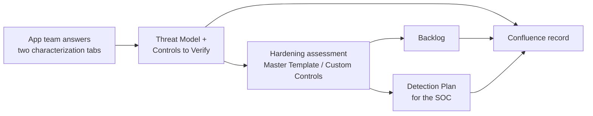

# Application Hardening Baseline + Threat Modeling

## What this is, in plain terms

Every application (a website, a mobile app, an internal system, a product bought from a vendor) needs two
things from a security point of view:

- **A checklist of security best practices** — "passwords must be strong," "user sessions must expire,"
  "sensitive data must be protected" — and a record of which ones the application actually meets.
- **A threat model** — a short list of the realistic ways the application could be attacked, what already
  protects against each attack, what is still missing, and what the security monitoring team (SOC) should
  watch for.

Doing both from scratch for every application, in Word documents, is slow and inconsistent. This repository
does both with **one Excel file per application**. You answer a short questionnaire about the application
(about 20–30 minutes of simple, mostly multiple-choice questions) and the file works out the rest by itself:

- the checklist narrows itself down to the items that apply to that application and ranks them by urgency;
- the threat model lists the threats that apply, how risky each one is and which checklist items protect
  against it;
- as the team records which checklist items are covered, the file shows which threats are still open, what
  to fix first, and which detections the SOC should deploy.

**Excel only.** Everything is calculated by formulas inside the file: no macros, no scripts, nothing to
install or run. It needs **Excel for Microsoft 365** (it uses Excel's newer "dynamic array" formulas).

The checklist itself is not invented here — it is the **OWASP ASVS**, an internationally recognized,
independently maintained list of application-security requirements (345 items in total), plus room for the
organization's own rules.

## How it fits together

Every box after the first one is a tab of the same spreadsheet that fills itself in.

## What's inside

| What | Where | What it's for |
| --- | --- | --- |
| The spreadsheet | [`templates/ASVS_Master_Hardening_Template.xlsx`](templates/ASVS_Master_Hardening_Template.xlsx) | The actual tool: make one copy per application. |
| A filled-in example | [`examples/Example_COTS_Hosted_App.xlsx`](examples/Example_COTS_Hosted_App.xlsx) | A fictional vendor product, fully answered, so you can see what every tab looks like with content. |
| The rulebook | [`docs/hardening-baseline-governance.md`](docs/hardening-baseline-governance.md) | What "secure enough" means and why — the reasoning behind the checklist. |
| How the threat model works | [`docs/threat-modeling-method.md`](docs/threat-modeling-method.md) | The method in plain terms, plus the guide for whoever maintains the threat catalog. |
| Map of the spreadsheet | [`docs/workbook-structure.md`](docs/workbook-structure.md) | Every tab, column and named cell, and the ID conventions. |
| Detection rules | [`detections/sigma/`](detections/sigma/) | One rule file per detection, in the vendor-neutral Sigma format the SOC can convert to its own tool. |
| The published-record template | [`docs/confluence-page-template.md`](docs/confluence-page-template.md) + [`templates/confluence-page-template.xml`](templates/confluence-page-template.xml) | How the filled-in spreadsheet becomes the application's official, shareable page. |

## How to handle one application, step by step

1. **Make a copy of the spreadsheet** and rename it after the application.
2. **Answer the "Characterization Form" tab** (the yellow cells): whether the application has a public website,
   whether it stores sensitive information, how serious it would be if something went wrong, and so on. Every
   question has a small, fixed list of answers to pick from.
3. **Answer the "Extended Characterization" tab** — more questions of the same kind: who uses the application,
   how people log in, whether it's built in-house or bought from a vendor, where it runs, what gets logged. Rows
   that turn grey and say **N/A** don't apply given earlier answers — skip them. The "Status" column must show no
   **Missing**. "Don't know" is an accepted answer, but on a required question it shows **Review**.
4. **Look at the review flag** at the bottom of that tab. If **NEEDS_SECURITY_REVIEW** says **Yes**, the
   application has something the automatic process can't judge alone (the reasons are listed) — bring in the
   Security team.
5. **Open the "Threat Model" and "Controls to Verify" tabs.** They are already filled in — there is nothing to
   run. The threat model **does not wait for the full checklist**: right after the questionnaire it lists the
   threats that apply, and "Controls to Verify" lists the checklist items to check first.
6. **Assess the checklist.** On "Master Template" (and "Custom Controls"), filter "Applicable?" to "Applicable"
   and, for each item, record whether it's covered today (Full coverage / Partial coverage / Gap), what proves
   it, and any notes. **Start with the items marked "Verify first?" = Yes**, then go through the rest — instead
   of working through 150–250 rows blindly. As you go, the threat model shows which threats are mitigated and
   which are still open.
7. **For every Partial coverage or Gap, fill in "Remediation Owner"** — who can actually fix it: our developers
   (*Internal dev*), a setting (*Configuration*), the *Vendor*, a protection placed around the application
   (*Compensating* — e.g., a web application firewall), or a formal decision not to fix it (*Risk acceptance*).
8. **Open "Backlog" and "Detection Plan".** The backlog is the list of what to fix, in order, plus the log
   sources that need to be switched on. The detection plan is what the SOC should deploy; record its progress in
   the "Deployment status" column of the "Detections" tab.
9. **Publish the result** on the application's Confluence page — see
   [`docs/confluence-page-template.md`](docs/confluence-page-template.md).

## A few terms explained

- **ASVS** — the security checklist standard this baseline is built on, maintained by OWASP (a nonprofit,
  vendor-neutral security organization). Think of it as a building code, but for applications.
- **Level (L1 / L2 / L3)** — how strict the checklist should be for a given application. L1 is the baseline
  every application should meet; L2 is for applications handling sensitive data; L3 is for high-stakes
  applications (e.g., regulated financial or health data).
- **Criticality (Low / Medium / High / Critical)** — how urgently a checklist item should be addressed for this
  specific application. It's computed automatically.
- **Coverage status** — whether an applicable item is actually in place today: fully, partially, or not at all
  (a gap).
- **Threat** — a realistic way the application could be attacked, e.g. "someone replays leaked passwords
  against the login." Threats are grouped with **STRIDE**, a common list of six kinds of attack: pretending to
  be someone else, tampering, denying having done something, leaking information, taking the service down, and
  gaining more rights than allowed.
- **Mitigation status** — whether the checklist items that protect against a threat are in place.
- **Detection** — a rule the SOC runs over the logs to spot an attack in progress. Detections complement the
  checklist; they never replace it.
- **Remediation owner** — who can close a gap: our developers, a configuration change, the vendor, a protection
  placed around the application, or a formal risk acceptance.
- **COTS** — "commercial off-the-shelf": a product bought from a vendor rather than built in-house.

## Where the target level, criticality and threat risk come from

If the company already has an official way of rating how sensitive or important an application is, use it to
decide the target ASVS level. Otherwise: no sensitive data and no outside users → L1; sensitive data, logins,
or outside partners → L2; regulated financial or health data, or actions that can't be undone → L3.

Criticality works automatically, from three questions: how sensitive the data is, how exposed the application
is, and how bad it would be if it were breached or went down. The riskiest of the three sets the application's
**Risk Tier**, and every applicable item is ranked against it. The threat model uses the **same Risk Tier** —
there is only one risk rating per application. Details are in
[`docs/hardening-baseline-governance.md`](docs/hardening-baseline-governance.md#risk-tiering--criticality) and
[`docs/threat-modeling-method.md`](docs/threat-modeling-method.md).

## Adding your own controls and threats

- **Your own checklist items** go on the "Custom Controls" tab, never on "Master Template" (which stays an exact
  copy of ASVS, so it can be refreshed when a new ASVS version comes out). IDs: `CUSTOM-01`, `CUSTOM-02`, … for
  the organization's own rules, and `TMX-…` (e.g. `TMX-VENDOR-001`) for protections that come from threat
  modeling — typically around vendor products.
- **Threats, detections and log sources** live in the catalog tabs (purple). They are maintained centrally, in
  the master spreadsheet only, by the Security team — see the maintainer guide in
  [`docs/threat-modeling-method.md`](docs/threat-modeling-method.md). The starter catalog shipped here is marked
  **Draft**: review it before relying on it.

## Keeping it up to date

This is one shared, living baseline. A change (a new requirement, a new threat, an updated rule) is made once,
in the master spreadsheet, directly in Excel; every application's next copy picks it up. After any change, the
"Catalog Health" tab of the master must say **OK**, the template version is increased, and the change is
recorded in [`CHANGELOG.md`](CHANGELOG.md). Moving an existing application copy to a new template version is a
copy-paste of its answers and statuses — the steps are in
[`docs/threat-modeling-method.md`](docs/threat-modeling-method.md#upgrading-an-application-copy).
